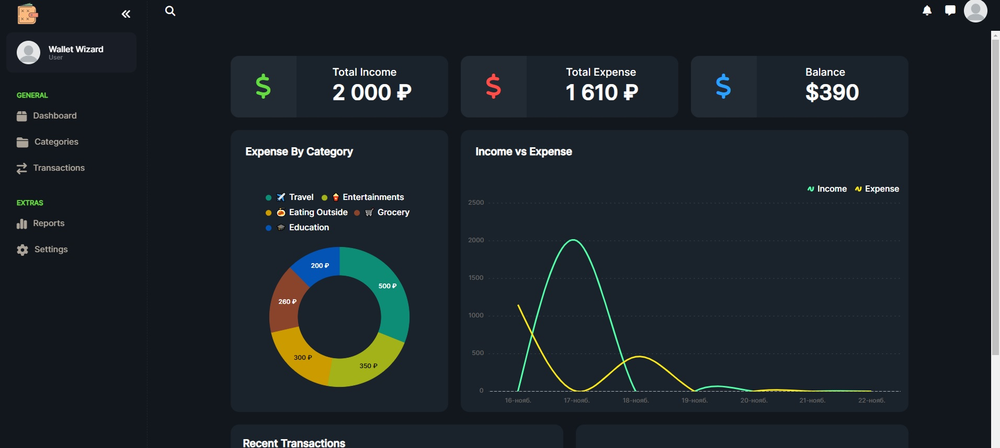
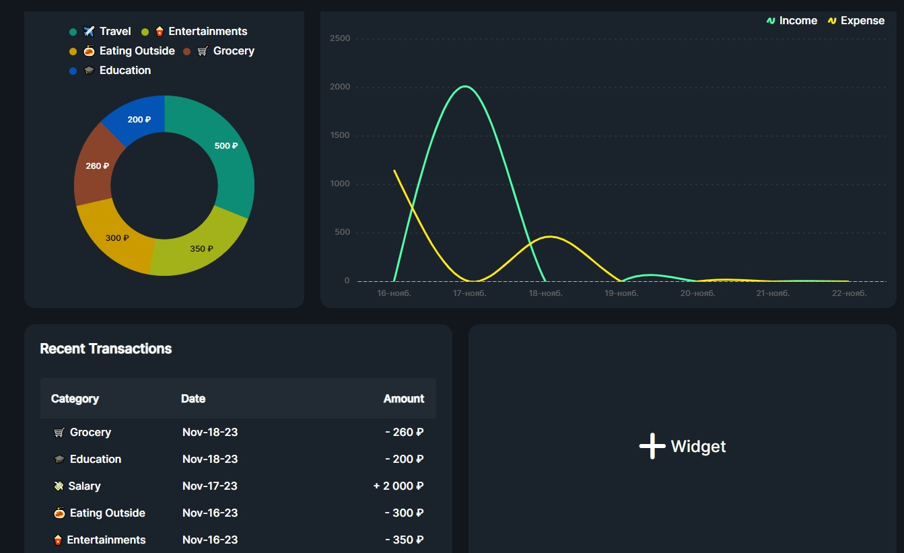
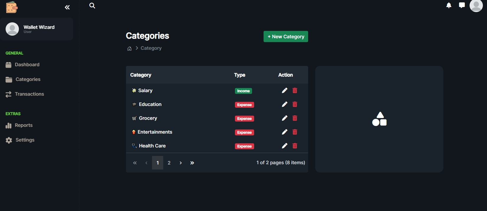
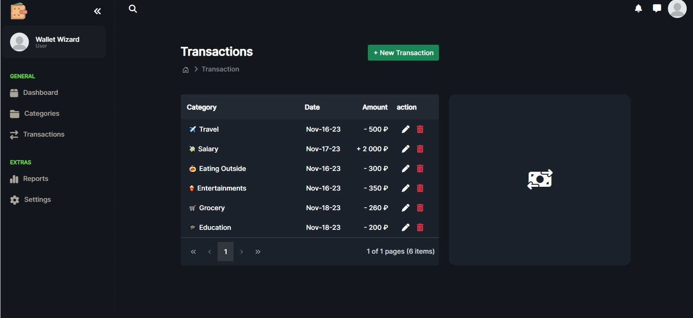

# Wallet Wizard 
Budget Tracking Web Application (ASP.NET Core MVC, EF, Migration, JavaScript, CSS, HTML, Syncfusion). Web Application helps users log, categorize, and view their expenses and incomes.

